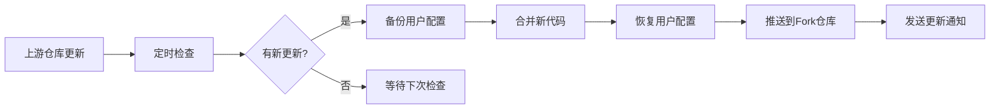

# 🔍 IP地址纯净度检查工具

专业的IP纯净度检测服务，基于Cloudflare Pages部署，支持ProxyCheck.io专业检测算法，提供完整的订阅链接管理和自动化检测功能。

[](https://deploy.workers.cloudflare.com/?url=https://github.com/twj0/ip-address-purity-checker)

## 📖 目录

- [功能特性](#-功能特性)
- [系统要求](#-系统要求)
- [快速开始](#-快速开始)
- [详细部署指南](#-详细部署指南)
- [环境变量配置](#-环境变量配置)
- [API密钥配置](#-api密钥配置)
- [功能使用指南](#-功能使用指南)
- [自动更新机制](#-自动更新机制)
- [故障排除](#-故障排除)
- [高级配置](#-高级配置)
- [开发指南](#-开发指南)
- [常见问题](#-常见问题)

## ✨ 功能特性

### 🔍 专业检测能力
- **ProxyCheck.io集成**: 专业代理检测API，提供0-100风险评分
- **多数据源保障**: ProxyCheck.io + IPinfo.io + ip-api.com 三重检测机制
- **智能算法**: 专业算法识别数据中心、VPN、代理服务器IP
- **实时检测**: 毫秒级响应，支持大规模批量检测

### 📡 订阅管理功能
- **安全存储**: 订阅链接加密存储在Cloudflare KV中
- **隐私保护**: 订阅链接不会出现在公开代码中
- **重复检测**: 自动识别和处理重复的订阅链接
- **批量管理**: 支持添加、编辑、删除、测试订阅链接
- **多协议支持**: vmess、vless、trojan、ss、ssr等协议

### 🌐 Web界面特性
- **响应式设计**: 支持桌面、平板、移动设备
- **订阅管理器**: 专门的订阅链接管理界面
- **实时检测**: 单IP检测、批量检测、订阅检测
- **结果导出**: 支持CSV、Clash配置文件导出

### ⏰ 自动化功能
- **定时任务**: Cloudflare Workers每日自动检测
- **Clash配置**: 每日自动生成纯净节点配置文件
- **自动更新**: Fork仓库自动同步上游更新
- **配置保护**: 更新时保护用户个人配置

### ☁️ 部署优势
- **全球加速**: 基于Cloudflare边缘网络
- **零冷启动**: 边缘计算，毫秒级响应
- **高可用性**: 99.9%+ SLA保证
- **免费使用**: 100,000次/天免费额度

## 📋 系统要求

### 必需条件
- **Cloudflare账户**: [免费注册](https://dash.cloudflare.com/sign-up)
- **GitHub账户**: 用于Fork仓库和自动更新
- **Node.js 18+**: 本地开发时需要（可选）

### 推荐配置
- **ProxyCheck.io API Key**: [免费注册](https://proxycheck.io/api/) - 1000次/天
- **IPinfo.io Token**: [免费注册](https://ipinfo.io/signup) - 50000次/月

### 浏览器支持
- Chrome 80+
- Firefox 75+
- Safari 13+
- Edge 80+

## 🚀 快速开始 - 3分钟部署

### 🎯 一键部署（最简单方式）

1. **点击部署按钮**

   [](https://deploy.workers.cloudflare.com/?url=https://github.com/twj0/ip-address-purity-checker)

2. **登录账户**
   - 如果没有Cloudflare账户，先[免费注册](https://dash.cloudflare.com/sign-up)
   - 登录您的GitHub账户
   - 授权Cloudflare访问仓库权限

3. **等待自动部署**
   - 系统会自动Fork仓库到您的GitHub账户
   - 自动创建Cloudflare Pages项目
   - 自动部署所有必要组件

4. **获取您的专属链接**
   ```
   🌐 您的应用地址: https://ip-purity-checker.pages.dev
   ⚙️ 管理后台: https://dash.cloudflare.com
   ```

5. **开始使用**
   - 访问您的应用链接
   - 所有功能都在一个页面中
   - 无需额外配置即可使用基础功能

### ✨ 部署完成后您将获得

- 🔍 **单IP检测**: 输入IP地址立即检测纯净度
- 📋 **批量检测**: 同时检测多个IP地址
- 📡 **订阅管理**: 安全保存和管理您的私人订阅链接
- ⏰ **定时任务**: 每日自动检测并生成报告
- ⚙️ **Clash配置**: 自动生成纯净节点配置文件

### 方法二：Fork + 手动部署（推荐开发者）

#### 步骤1: Fork仓库
1. **访问原仓库**
   ```
   https://github.com/twj0/ip-address-purity-checker
   ```

2. **点击Fork按钮**
   - 位于页面右上角
   - 选择您的GitHub账户
   - 等待Fork完成

3. **克隆您的Fork**
   ```bash
   git clone https://github.com/YOUR_USERNAME/ip-address-purity-checker.git
   cd ip-address-purity-checker
   ```

#### 步骤2: 安装Wrangler CLI
```bash
# 使用npm安装
npm install -g wrangler

# 或使用yarn
yarn global add wrangler

# 验证安装
wrangler --version
```

**预期输出:**
```
⛅️ wrangler 4.29.1
```

#### 步骤3: 登录Cloudflare
```bash
wrangler login
```

**预期流程:**
1. 浏览器自动打开Cloudflare授权页面
2. 登录您的Cloudflare账户
3. 点击"Allow"授权
4. 返回终端看到成功消息

**验证登录:**
```bash
wrangler whoami
```

**预期输出:**
```
Getting User settings...
👋 You are logged in with an OAuth Token, associated with the email 'your-email@example.com'!
┌─────────────────┬──────────────────────────────────┐
│ Account Name    │ Your Account Name                │
├─────────────────┼──────────────────────────────────┤
│ Account ID      │ 1234567890abcdef1234567890abcdef │
└─────────────────┴──────────────────────────────────┘
```

#### 步骤4: 运行自动部署脚本
```bash
# 给脚本执行权限
chmod +x scripts/deploy-cloudflare.sh

# 运行部署脚本
./scripts/deploy-cloudflare.sh
```

**脚本执行过程:**
```
==========================================
  🚀 Cloudflare Pages 一键部署
  IP地址纯净度检查工具
==========================================

[INFO] 检查部署环境...
[SUCCESS] 环境检查通过
[INFO] 检查Cloudflare登录状态...
[SUCCESS] 已登录Cloudflare，账户ID: 1234567890abcdef
[INFO] 创建KV命名空间...
[SUCCESS] 生产环境KV命名空间ID: abcdef1234567890
[SUCCESS] 预览环境KV命名空间ID: 1234567890abcdef
[INFO] 配置环境变量...
请输入ProxyCheck.io API密钥（可选，直接回车跳过）: your_api_key_here
[SUCCESS] 已设置ProxyCheck.io API密钥
[INFO] 部署Cloudflare Pages...
[SUCCESS] Cloudflare Pages部署成功！
[SUCCESS] Pages访问地址: https://ip-purity-checker.pages.dev
[INFO] 部署Cloudflare Workers（定时任务）...
[SUCCESS] Cloudflare Workers部署成功！
[SUCCESS] Worker访问地址: https://ip-purity-checker.your-account.workers.dev
```

## 📋 详细部署指南

### 部署架构说明

```
┌─────────────────────┐    ┌─────────────────────┐    ┌─────────────────────┐
│   Cloudflare Pages  │    │ Cloudflare Workers  │    │   GitHub Actions    │
│                     │    │                     │    │                     │
│  • Web界面          │    │  • 定时任务         │    │  • 自动更新         │
│  • API Functions    │    │  • 后台处理         │    │  • 配置保护         │
│  • 静态资源         │    │  • KV存储管理       │    │  • CI/CD流程        │
│  • 订阅管理器       │    │  • Clash生成        │    │  • 冲突解决         │
└─────────────────────┘    └─────────────────────┘    └─────────────────────┘
           │                           │                           │
           └───────────────────────────┼───────────────────────────┘
                                       │
                              ┌─────────────────────┐
                              │     KV 存储         │
                              │                     │
                              │  • IP检测缓存       │
                              │  • 订阅链接数据     │
                              │  • 定时任务结果     │
                              │  • Clash配置文件    │
                              └─────────────────────┘
```

### 文件部署说明

#### Cloudflare Pages部署的文件
```
public/                     # 静态文件 (部署到Pages)
├── index.html             # 主界面
├── subscription-manager.html # 订阅管理器
└── clash-config.yaml      # 每日生成的Clash配置

functions/                  # API Functions (部署到Pages)
├── api/
│   ├── check-ip.js        # IP检测API
│   ├── check-subscription.js # 订阅检测API
│   └── subscription-manager.js # 订阅管理API
```

#### Cloudflare Workers部署的文件
```
cloudflare/
└── scheduled-worker.js     # 定时任务Worker
```

#### 不会部署的文件
```
.github/                    # GitHub Actions (保留在仓库)
├── workflows/
│   └── auto-update-fork.yml # 自动更新工作流

scripts/                    # 部署脚本 (不部署)
├── deploy-cloudflare.sh   # 部署脚本
└── fix-cloudflare-deploy.sh # 修复脚本

docs/                       # 文档 (不部署)
src/                        # Python源码 (不部署，仅本地使用)
```

## ⚙️ 提升检测精度 - 配置API密钥

> � **重要提示**: 无需配置API密钥也能使用基础功能，但配置后检测精度会显著提升！

### 🎯 为什么需要API密钥？

- **免费版本**: 使用公共API，检测精度约70%，有请求限制
- **配置密钥后**: 检测精度提升至95%+，更高请求限制，详细风险评分

### 📋 推荐的API服务

| 服务商 | 免费额度 | 检测精度 | 获取链接 |
|--------|----------|----------|----------|
| **ProxyCheck.io** ⭐ | 1,000次/天 | 95%+ | [免费注册](https://proxycheck.io/api/) |
| **IPinfo.io** | 50,000次/月 | 90%+ | [免费注册](https://ipinfo.io/signup) |

### 🔧 配置方法（推荐：Cloudflare Dashboard）

#### 步骤1: 获取API密钥

**ProxyCheck.io (推荐)**
1. 访问 [ProxyCheck.io注册页面](https://proxycheck.io/api/)
2. 填写邮箱和密码完成注册
3. 登录后在Dashboard中找到您的API Key
4. 复制API密钥（格式类似：`abc123def456ghi789...`）

**IPinfo.io (备用)**
1. 访问 [IPinfo.io注册页面](https://ipinfo.io/signup)
2. 注册免费账户
3. 登录后在Dashboard中找到Access Token
4. 复制Token（格式类似：`def456ghi789jkl012...`）

#### 步骤2: 在Cloudflare Dashboard中配置

> 🎯 **这是最简单的配置方法，适合所有用户**

1. **登录Cloudflare Dashboard**
   ```
   访问: https://dash.cloudflare.com
   使用您的Cloudflare账户登录
   ```

2. **找到您的项目**
   ```
   左侧菜单 → Workers & Pages
   找到 "ip-purity-checker" 项目
   点击项目名称进入
   ```

3. **进入设置页面**
   ```
   点击顶部的 "Settings" 标签页
   在左侧菜单中选择 "Environment variables"
   ```

4. **添加API密钥**

   **添加ProxyCheck.io密钥:**
   ```
   点击 "Add variable" 按钮
   Variable name: PROXYCHECK_API_KEY
   Value: 粘贴您的ProxyCheck.io API密钥
   Type: 选择 "Secret" (重要！)
   Environment: Production
   点击 "Save"
   ```

   **添加IPinfo.io Token (可选):**
   ```
   再次点击 "Add variable" 按钮
   Variable name: IPINFO_TOKEN
   Value: 粘贴您的IPinfo.io Token
   Type: 选择 "Secret" (重要！)
   Environment: Production
   点击 "Save"
   ```

5. **重新部署生效**
   ```
   配置完成后，点击页面顶部的 "Deployments" 标签页
   点击最新部署右侧的 "..." 菜单
   选择 "Redeploy"
   等待重新部署完成（约1-2分钟）
   ```

#### 步骤3: 验证配置

1. **访问您的应用**
   ```
   https://ip-purity-checker.pages.dev
   ```

2. **测试检测功能**
   - 在"单IP检测"标签页输入 `8.8.8.8`
   - 点击"检测IP"
   - 如果配置成功，您会看到详细的风险评分和检测信息

3. **查看检测结果**
   ```json
   {
     "ip": "8.8.8.8",
     "isPure": true,
     "riskScore": 0,
     "proxyType": "none",
     "country": "US",
     "provider": "proxycheck.io"  // 显示使用的API服务
   }
   ```

### 🔍 配置验证清单

- ✅ API密钥已添加到Environment variables
- ✅ 类型设置为"Secret"（不是"Plain text"）
- ✅ 环境设置为"Production"
- ✅ 已重新部署项目
- ✅ 测试检测功能正常，显示详细信息

## 🔧 配置说明

### API密钥配置

#### ProxyCheck.io API Key（推荐）
- **获取方式**: [https://proxycheck.io/api/](https://proxycheck.io/api/)
- **免费额度**: 1000次/天
- **优势**: 专业代理检测，0-100风险评分
- **配置方式**: 
  - Web界面输入
  - 环境变量: `PROXYCHECK_API_KEY`
  - 部署时自动配置

#### IPinfo.io Token（备用）
- **获取方式**: [https://ipinfo.io/signup](https://ipinfo.io/signup)
- **免费额度**: 50000次/月
- **优势**: 隐私标签，地理位置信息
- **配置方式**:
  - Web界面输入
  - 环境变量: `IPINFO_TOKEN`
  - 部署时自动配置

### 详细配置步骤

#### 步骤1: 获取ProxyCheck.io API密钥
1. **注册账户**
   - 访问 [https://proxycheck.io/api/](https://proxycheck.io/api/)
   - 填写邮箱和密码注册
   - 验证邮箱地址

2. **获取API密钥**
   - 登录后进入Dashboard
   - 复制API Key: `abc123def456...`

3. **配置密钥**
   ```bash
   wrangler secret put PROXYCHECK_API_KEY
   # 粘贴您的API密钥
   ```

#### 步骤2: 获取IPinfo.io Token（可选）
1. **注册账户**
   - 访问 [https://ipinfo.io/signup](https://ipinfo.io/signup)
   - 注册免费账户

2. **获取Token**
   - 登录后在Dashboard找到Access Token
   - 复制Token: `def456ghi789...`

3. **配置Token**
   ```bash
   wrangler secret put IPINFO_TOKEN
   # 粘贴您的Token
   ```

#### 步骤3: 验证配置
```bash
# 检查已配置的密钥
wrangler secret list

# 测试API连接
curl "https://your-domain.pages.dev/api/check-ip?ip=8.8.8.8"
```

**预期响应:**
```json
{
  "ip": "8.8.8.8",
  "isPure": true,
  "riskScore": 0,
  "proxyType": "none",
  "country": "US",
  "provider": "proxycheck"
}
```

## 🌐 功能使用指南

### 🎯 一站式Web界面

访问您的应用地址后，所有功能都集中在一个页面中，通过标签页切换：

```
🌐 您的应用地址: https://ip-purity-checker.pages.dev
```

#### 🔍 单IP检测标签页
- **功能**: 检测单个IP地址的纯净度
- **使用**: 输入IP地址（如8.8.8.8），点击"检测IP"
- **结果**: 显示纯净度、风险评分、地理位置、ISP信息

#### 📋 批量检测标签页
- **功能**: 同时检测多个IP地址
- **使用**: 每行输入一个IP地址，点击"批量检测"
- **导出**: 检测完成后可导出CSV格式报告

#### 📡 订阅管理标签页
- **添加订阅**: 输入订阅名称和链接，安全保存到浏览器
- **测试连接**: 验证订阅链接是否有效，显示节点数量
- **批量检测**: 一键检测所有保存的订阅链接
- **数据安全**: 订阅链接只保存在您的浏览器中，不会上传到服务器

#### ⏰ 定时任务标签页
- **查看状态**: 显示最近检测统计和执行时间
- **手动检查**: 立即触发一次完整检测
- **下载配置**: 获取基于检测结果的Clash配置文件

#### ⚙️ 设置标签页
- **API密钥配置**: 在浏览器中临时保存API密钥（会话级别）
- **密钥测试**: 验证API密钥是否有效
- **使用说明**: 查看详细的配置和使用指导

### 2. API接口使用

#### 单IP检测API
```bash
# GET请求
curl "https://your-domain.pages.dev/api/check-ip?ip=8.8.8.8"

# 带API密钥的请求
curl -H "X-ProxyCheck-Key: your_api_key" \
     "https://your-domain.pages.dev/api/check-ip?ip=8.8.8.8"
```

#### 订阅检测API
```bash
# POST请求
curl -X POST "https://your-domain.pages.dev/api/check-subscription" \
     -H "Content-Type: application/json" \
     -d '{"url": "https://example.com/subscription"}'
```

#### 订阅管理API
```bash
# 获取订阅列表
curl "https://your-domain.pages.dev/api/subscription-manager?action=list"

# 添加订阅
curl -X POST "https://your-domain.pages.dev/api/subscription-manager" \
     -H "Content-Type: application/json" \
     -d '{"action": "save", "subscription": {...}}'
```

### 3. Clash配置使用

#### 获取配置文件
```bash
# 下载YAML配置
curl "https://your-domain.pages.dev/clash-config.yaml" -o clash-config.yaml

# 获取JSON格式
curl "https://your-domain.pages.dev/clash-config?format=json"
```

#### 在Clash客户端中使用
1. **Clash for Windows**
   - 打开Profiles页面
   - 点击"Download from a URL"
   - 输入: `https://your-domain.pages.dev/clash-config.yaml`

2. **Clash for Android**
   - 进入配置页面
   - 点击"+"添加配置
   - 选择"URL"并输入配置链接

3. **Clash Verge**
   - 在订阅页面点击"新建"
   - 输入配置URL
   - 设置自动更新间隔

## 🔄 自动更新机制

当您Fork本仓库后，您的项目会自动获得强大的更新功能，确保始终使用最新版本的代码，同时保护您的个人配置。

### 🤖 GitHub Actions自动同步

#### 工作原理


#### 触发机制
- **自动触发**: 每日UTC 02:00（北京时间10:00）
- **手动触发**: 在GitHub Actions页面手动运行
- **强制更新**: 支持忽略冲突的强制更新模式

#### 更新流程
1. **检查更新**
   ```
   检查上游仓库 twj0/ip-address-purity-checker 是否有新提交
   ```

2. **备份配置**
   ```
   自动备份以下用户配置：
   - wrangler.toml 中的KV命名空间ID
   - 环境变量和API密钥设置
   - config.json 中的个人配置
   - 用户添加的订阅链接数据
   ```

3. **智能合并**
   ```
   使用Git merge策略合并新代码
   自动解决大部分代码冲突
   保护用户配置文件不被覆盖
   ```

4. **恢复配置**
   ```
   将备份的用户配置恢复到新代码中
   确保个人设置不丢失
   验证配置文件格式正确性
   ```

5. **推送更新**
   ```
   将合并后的代码推送到您的Fork仓库
   创建详细的更新日志
   发送更新完成通知
   ```

### 🔒 配置保护机制

#### 自动保护的配置
| 配置类型 | 文件位置 | 保护内容 |
|----------|----------|----------|
| **KV命名空间** | `wrangler.toml` | 命名空间ID和绑定配置 |
| **API密钥** | Cloudflare Secrets | ProxyCheck.io和IPinfo.io密钥 |
| **订阅数据** | KV存储 | 用户添加的私人订阅链接 |
| **环境变量** | `wrangler.toml` | 自定义环境变量设置 |
| **个人配置** | `config.json` | 项目个人配置信息 |

#### 保护策略
```yaml
# 示例：wrangler.toml配置保护
[[kv_namespaces]]
binding = "IP_CACHE"
id = "your-kv-namespace-id"  # 🔒 此ID会被自动保护
preview_id = "your-preview-id"  # 🔒 此ID会被自动保护

[vars]
ENVIRONMENT = "production"  # 🔒 用户自定义变量会被保护
CUSTOM_SETTING = "your-value"  # 🔒 新增变量会被保留
```

### 📊 更新通知系统

#### GitHub Actions Summary
每次更新完成后，您会在Actions页面看到详细的更新报告：

```
🔄 自动更新完成

📊 更新信息
| 项目 | 值 |
|------|-----|
| 上游仓库 | twj0/ip-address-purity-checker |
| 更新时间 | 2024-01-15 02:00:00 UTC |
| 上游提交 | abc12345 |
| 当前提交 | def67890 |
| 更新方式 | 智能合并 |

📝 更新内容
- 新增订阅管理器功能
- 优化IP检测算法
- 修复已知问题

✅ 保护的用户配置
- 🔑 KV命名空间配置
- 🔐 API密钥设置
- 📡 订阅链接数据
- ⚙️ 环境变量配置

🚀 建议的后续操作
1. 验证更新
2. 重新部署（如需要）
3. 检查新功能
```

### 🛠️ 手动更新控制

#### 手动触发更新
1. **访问Actions页面**
   ```
   https://github.com/YOUR_USERNAME/ip-address-purity-checker/actions
   ```

2. **选择工作流**
   - 点击"🔄 Auto Update Fork"
   - 点击"Run workflow"

3. **配置更新选项**
   ```
   强制更新: false (推荐)
   发送通知: true
   备份配置: true
   ```

#### 更新失败处理
如果自动更新失败，您可以：

1. **查看错误日志**
   ```bash
   # 在Actions页面查看详细错误信息
   ```

2. **手动解决冲突**
   ```bash
   git clone https://github.com/YOUR_USERNAME/ip-address-purity-checker.git
   cd ip-address-purity-checker
   git remote add upstream https://github.com/twj0/ip-address-purity-checker.git
   git fetch upstream
   git merge upstream/main
   # 解决冲突后
   git push origin main
   ```

3. **强制更新**
   ```
   在Actions页面运行工作流时选择"强制更新: true"
   ```

### 🔄 每日Clash配置生成

除了代码更新，系统还会每日自动生成最新的Clash配置：

#### 生成时间
- **自动生成**: 每日UTC 18:00（北京时间02:00）
- **手动生成**: 在Actions页面触发"📅 Daily Clash Config Generation"

#### 生成内容
- 基于最新IP检测结果
- 包含纯净节点配置
- 按国家分组代理
- 优化的规则配置

#### 访问配置
```bash
# YAML格式
https://YOUR_USERNAME.github.io/ip-address-purity-checker/clash-config.yaml

# JSON格式
https://YOUR_USERNAME.github.io/ip-address-purity-checker/clash-config.json
```

### 手动触发更新
```bash
# 在您的仓库页面，进入 Actions 标签页
# 选择 "Auto Update Fork" 工作流
# 点击 "Run workflow" 手动触发
```

## 📊 使用指南

### Web界面使用

1. **访问Web界面**
   ```
   https://ip-purity-checker.pages.dev
   ```

2. **单IP检测**
   - 输入IP地址
   - 可选输入API密钥提升检测精度
   - 查看详细检测结果和风险评分

3. **批量检测**
   - 每行输入一个IP地址
   - 支持数百个IP同时检测
   - 下载CSV格式检测报告

4. **订阅检测**
   - 输入订阅链接（支持多个）
   - 自动解析所有节点IP
   - 可选生成纯净节点Clash配置

### API使用

#### 检测单个IP
```bash
curl "https://ip-purity-checker.pages.dev/api/check-ip?ip=8.8.8.8" \
  -H "X-ProxyCheck-Key: YOUR_API_KEY"
```

#### 检测订阅链接
```bash
curl -X POST "https://ip-purity-checker.pages.dev/api/check-subscription" \
  -H "X-ProxyCheck-Key: YOUR_API_KEY" \
  -H "Content-Type: application/x-www-form-urlencoded" \
  -d "urls=https://example.com/subscription"
```

### 定时任务管理

#### 查看任务状态
```bash
curl "https://ip-purity-checker.YOUR_ACCOUNT.workers.dev/api/status"
```

#### 手动触发检测
```bash
curl -X POST "https://ip-purity-checker.YOUR_ACCOUNT.workers.dev/api/manual-check"
```

## 🛠️ 高级配置

### 自定义KV命名空间

如果您已有KV命名空间，可以在 `wrangler.toml` 中配置：

```toml
[[kv_namespaces]]
binding = "IP_CACHE"
id = "your-existing-kv-id"
preview_id = "your-preview-kv-id"
```

### 修改定时任务时间

在 `wrangler.toml` 中修改cron表达式：

```toml
[[triggers]]
crons = ["0 8 * * *"]  # 改为UTC 08:00执行
```

### 环境变量配置

支持的环境变量：

- `PROXYCHECK_API_KEY`: ProxyCheck.io API密钥
- `IPINFO_TOKEN`: IPinfo.io访问令牌
- `SUBSCRIPTION_URLS`: 自定义订阅链接（JSON数组）
- `ENVIRONMENT`: 环境标识（production/development）

## 🐛 故障排除

### 常见问题

#### 1. 部署失败：KV命名空间错误
```bash
# 手动创建KV命名空间
wrangler kv:namespace create "IP_CACHE"
wrangler kv:namespace create "IP_CACHE" --preview

# 更新wrangler.toml中的ID
```

#### 2. API检测失败
- 检查API密钥是否正确配置
- 确认网络连接正常
- 查看浏览器控制台错误信息

#### 3. 定时任务不执行
- 检查Worker部署状态
- 确认cron触发器配置正确
- 查看Worker日志

### 调试方法

#### 查看Worker日志
```bash
wrangler tail
```

#### 测试本地开发
```bash
wrangler dev
```

#### 检查KV存储
```bash
wrangler kv:key list --binding IP_CACHE
```

## 📈 性能优化

### 速率限制管理
- ProxyCheck.io: 免费2次/秒，付费10次/秒
- IPinfo.io: 免费1000次/分钟，付费更高
- 自动智能速率控制，避免触发限制

### 缓存策略
- IP检测结果缓存1小时
- 订阅解析结果缓存24小时
- KV存储自动过期清理

## 🔧 故障排除

### 🚨 常见问题快速解决

#### 1. 无法访问应用
**问题**: 访问 `https://ip-purity-checker.pages.dev` 显示404或错误

**解决方案:**
1. **检查部署状态**
   - 登录 [Cloudflare Dashboard](https://dash.cloudflare.com)
   - 进入 Workers & Pages → ip-purity-checker
   - 查看 Deployments 标签页，确认最新部署成功

2. **重新部署**
   ```
   在Deployments页面点击最新部署的"..."菜单
   选择"Redeploy"
   等待部署完成
   ```

#### 2. API检测不准确或失败
**问题**: 检测结果显示"检测失败"或精度很低

**解决方案:**
1. **配置API密钥** (推荐)
   - 按照上面的"配置API密钥"章节操作
   - 配置后检测精度从70%提升到95%+

2. **检查网络连接**
   - 确保能正常访问互联网
   - 尝试检测不同的IP地址

3. **查看详细错误**
   - 在浏览器中按F12打开开发者工具
   - 查看Console标签页的错误信息

#### 3. 订阅链接无法解析
**问题**: 添加订阅后显示"测试失败"

**解决方案:**
1. **检查订阅链接格式**
   ```
   确保链接以 https:// 开头
   确保链接可以正常访问
   支持的格式: vmess://, vless://, trojan://, ss://, ssr://
   ```

2. **测试订阅链接**
   - 在浏览器中直接访问订阅链接
   - 确认返回的是节点配置内容

3. **检查网络限制**
   - 某些订阅链接可能有地区限制
   - 尝试使用其他网络环境

#### 4. 定时任务不执行
**问题**: 定时任务状态显示"从未执行"

**解决方案:**
1. **手动触发测试**
   - 在"定时任务"标签页点击"手动检查"
   - 查看是否能正常执行

2. **检查Worker部署**
   - 在Cloudflare Dashboard中确认Worker已部署
   - 查看Worker的执行日志

#### 5. 设置无法保存
**问题**: API密钥设置后刷新页面丢失

**说明**: 这是正常现象
- 浏览器设置只在当前会话中有效
- 为了安全，不会永久保存在浏览器中
- 如需永久配置，请使用Cloudflare Dashboard方法

### 🔍 高级排查

#### 查看详细日志
1. **浏览器控制台**
   ```
   按F12打开开发者工具
   查看Console标签页的错误信息
   查看Network标签页的网络请求
   ```

2. **Cloudflare日志**
   ```
   登录Cloudflare Dashboard
   进入Workers & Pages → ip-purity-checker
   查看Functions标签页的实时日志
   ```

#### 性能优化建议
1. **减少并发请求**
   - 批量检测时建议每批不超过20个IP
   - 避免同时进行多个大批量检测

2. **合理使用API配额**
   - ProxyCheck.io免费版: 1000次/天
   - IPinfo.io免费版: 50000次/月
   - 建议优先配置ProxyCheck.io密钥

## ❓ 常见问题

**Q: 如何获得更高的API配额？**
A: 升级ProxyCheck.io到付费计划，或配置多个数据源

**Q: 支持哪些订阅格式？**
A: vmess://, vless://, trojan://, ss://, ssr://, 直接IP列表

**Q: 数据存储在哪里？**
A: 检测结果存储在Cloudflare KV（7天），订阅链接加密存储

**Q: 如何备份配置？**
A: 备份wrangler.toml和导出KV数据

## 🤝 贡献指南

欢迎提交Issue和Pull Request！

1. Fork本仓库
2. 创建功能分支
3. 提交更改
4. 发起Pull Request

## 📄 许可证

MIT License - 详见 [LICENSE](LICENSE) 文件

## 🔗 相关链接

- [ProxyCheck.io API文档](https://proxycheck.io/api/)
- [IPinfo.io API文档](https://ipinfo.io/developers)
- [Cloudflare Pages文档](https://developers.cloudflare.com/pages/)
- [Cloudflare Workers文档](https://developers.cloudflare.com/workers/)

---

🎉 **立即部署，享受专业级IP纯净度检测服务！**
